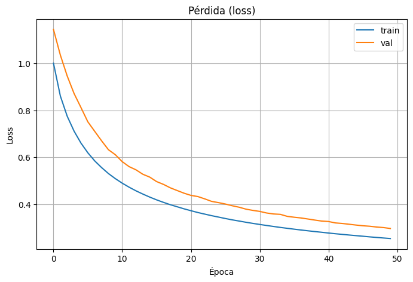
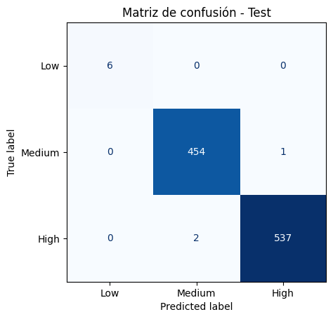

# Neural Networks and Simulation

Curated public snapshot of a neural-networks coursework project built around classification experiments, model comparison and representative final outputs.

## Overview

The original local notebook combines several stages of experimentation:

- baseline dense neural networks;
- deeper feed-forward variants with regularization;
- convolutional architectures explored later in the notebook;
- training-history inspection and final confusion-matrix analysis.

The public repository does not ship the original dataset, checkpoints or workstation-specific notebook dump.
Instead, it keeps a cleaner portfolio version centered on methodology notes, representative figures and a small helper that extracts public-safe outputs from the local notebook when needed.

## Included here

- `src/extract_notebook_result_figures.py`
  Small utility used to export representative embedded PNG outputs from the final notebook.
- `figures/training_history_reference.png`
  Representative training-history plot exported from the coursework notebook.
- `figures/final_confusion_matrix.png`
  Final confusion-matrix view exported from the notebook.
- `docs/manual_review.md`
  Notes explaining why the original notebook itself is not copied blindly.

## Visual preview

## Why the raw notebook is not published directly

The local source notebook still contains:

- absolute workstation paths;
- environment-specific execution traces;
- local dataset references;
- checkpoint-related material that should not be bundled publicly.

For that reason, the repository keeps only the parts that are useful and safe to share publicly.
