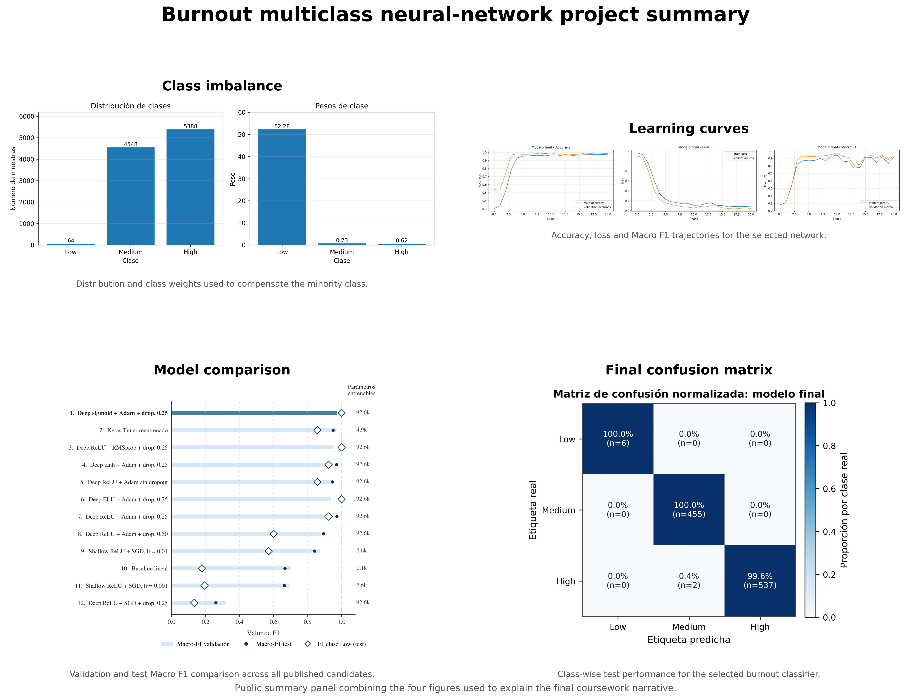
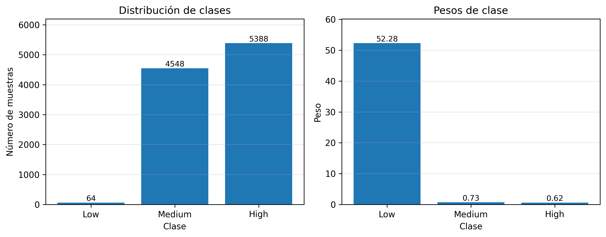
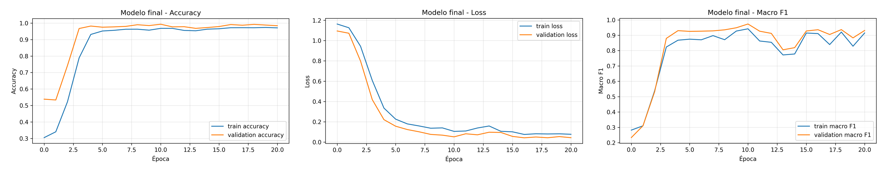
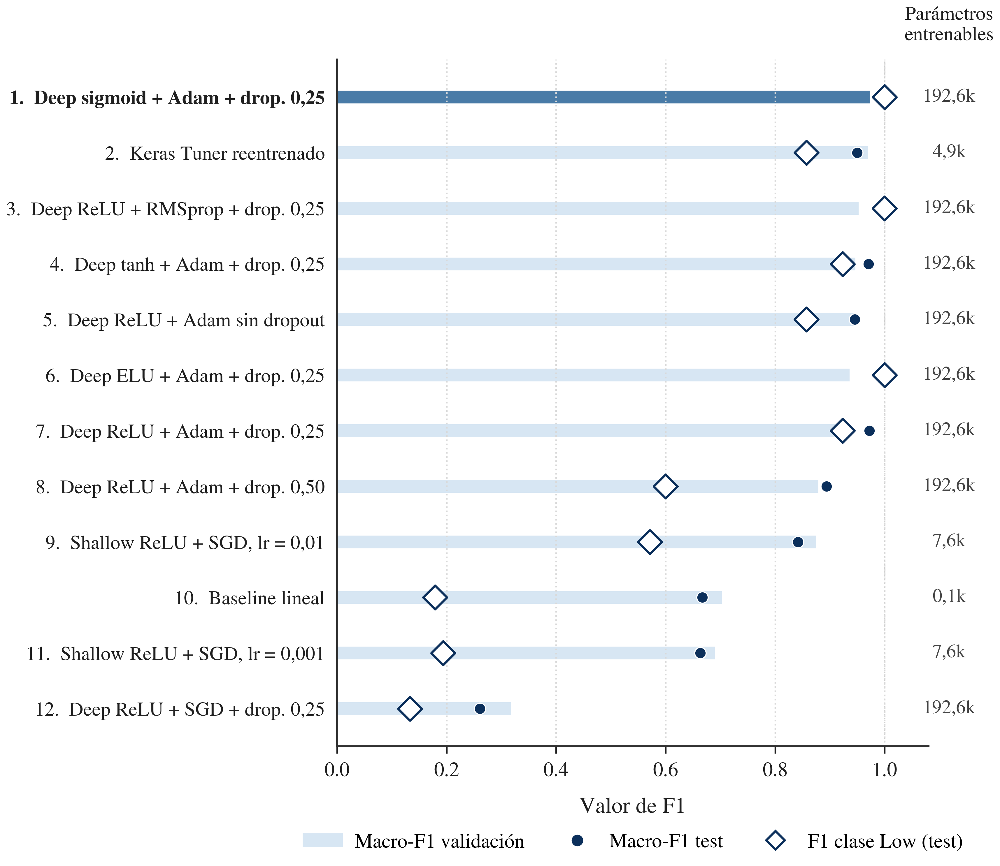
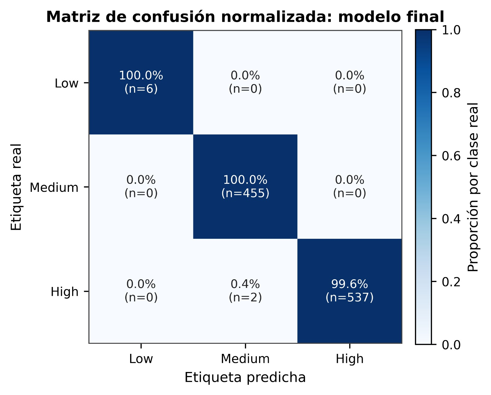

# Neural Networks and Simulation

Public-facing coursework repository built around a multiclass neural-network study for burnout-risk classification in a Gen Z population.

## Project focus

This repository now centers on a cleaner and more defensible project narrative than the original local coursework dump:

- tabular multiclass classification with strong class imbalance;
- reproducible train / validation / test splitting;
- leakage-safe preprocessing with scaling and one-hot encoding;
- comparison across baseline, shallow and deep multilayer perceptrons;
- class-weighted training and Macro F1-driven model selection;
- final report figures curated for public presentation.

The strongest model in the final comparison was a deep MLP with `sigmoid` activations, `Adam`, and `dropout=0.25`, selected using validation Macro F1 and then evaluated once on the held-out test split.

## What is included

- `notebooks/neural_networks_project_summary.ipynb`
  Lightweight public notebook that walks through the repository, loads the stored result tables and previews the report figures directly on GitHub.
- `src/burnout_multiclass_workflow.py`
  Clean Python script version of the coursework workflow, covering preprocessing, model comparison, Keras Tuner search and artifact export.
- `src/build_summary_panel.py`
  Helper that combines the report figures into a single portfolio-ready summary panel.
- `docs/methodology_overview.md`
  High-level explanation of the experimental design and modeling choices.
- `docs/results_summary.md`
  Concise narrative of the final findings captured in the public outputs.
- `results/model_comparison_summary.csv`
  Stored model-comparison table for the published experiment.
- `results/final_model_selection.csv`
  Compact final table used in the report-ready summary.
- `results/experiment_config.json`
  Public-safe record of the shared experiment configuration.
- `figures/`
  Curated figures extracted from the final report and aligned with the portfolio website.

## Repository structure

- `docs/`
  Publication notes, methodology and final findings.
- `figures/`
  Class balance, learning curves, model-comparison and confusion-matrix visuals.
- `notebooks/`
  Public notebook summary for GitHub reading.
- `results/`
  Safe CSV and JSON artifacts used by the notebook and README.
- `src/`
  Reusable Python scripts for the experiment workflow and figure generation.

## Main findings

- the dataset is strongly imbalanced, with the `Low` class representing a very small minority, so Macro F1 is more informative than accuracy alone;
- all models share the same split strategy, preprocessing stack, callbacks and maximum epoch budget, which makes the comparison easier to defend;
- the best validation Macro F1 was achieved by `deep_sigmoid_adam_dropout025` with `0.9734`;
- the same model reached `0.9986` Macro F1 and `0.9980` test accuracy on the final held-out split;
- the Keras Tuner retrained shallow model was competitive, but the deeper sigmoid network remained the strongest overall configuration.

## Visual summary



## Report figures









## Reproducibility note

The original dataset `GenZ_dataset.xlsx`, private course handouts and local execution traces are not published here.

If you want to rerun the full workflow locally, provide a compatible Excel file with a `Burnout_Risk` target column and execute:

```bash
python src/burnout_multiclass_workflow.py --data-path path/to/GenZ_dataset.xlsx
```

## Recommended reading order

1. `docs/methodology_overview.md`
2. `docs/results_summary.md`
3. `notebooks/neural_networks_project_summary.ipynb`
4. `results/model_comparison_summary.csv`
5. `src/burnout_multiclass_workflow.py`

## Publication note

This public version is intentionally curated around the final experimental workflow, the stored results and the figures used in the report, instead of exposing a raw private notebook dump.
